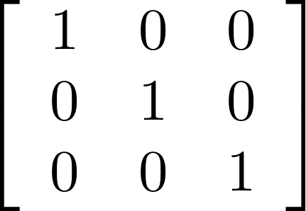

###### Graphics Programming - Exercise 8
# Transformations
In this exercise we will look at some transformations using matrices.

## Exercises
Save each step as a separate source file.

1. Create a blank HTML file with a CSS section and a JavaScript section.

    ```html
    <!DOCTYPE html>
    <html>
      <head>
        <title>D3.js Demo</title>
        <meta charset="UTF-8">
        <style type="text/css"></style>
      </head>
      <body>
        <script type="text/javascript"></script>
      </body>
    </html>
    ```

1. Matrix test

    1|0|1
    -|-|-
    0|1|0
    0|0|1



